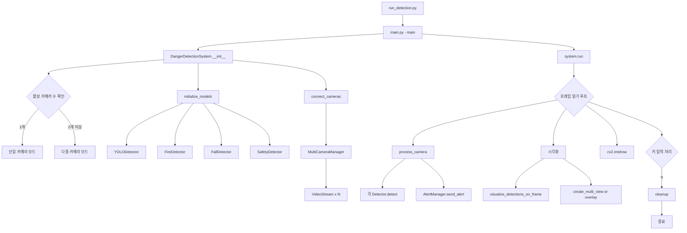

# 프로젝트의 전체 구조와 호출 순서 정리

## 프로젝트 구조 및 호출 관계

### 1. **프로젝트 전체 구조**
```
cctv-danger-detection/
├── run_detection.py          # 진입점
├── src/
│   ├── main.py              # 메인 로직
│   ├── config/
│   │   └── config.py        # 설정
│   ├── models/              # AI 모델
│   │   ├── yolo_detector.py
│   │   ├── fire_detector.py
│   │   ├── fall_detector.py
│   │   └── safety_detector.py
│   └── utils/               # 유틸리티
│       ├── video_stream.py
│       ├── alert_manager.py
│       └── multi_camera_manager.py
```

### 2. **호출 순서 다이어그램**



### 3. **클래스 관계도**

```
DangerDetectionSystem (main.py)
    ├── AlertManager (utils/alert_manager.py)
    │   └── 로깅 및 알림 관리
    │
    ├── MultiCameraManager (utils/multi_camera_manager.py)
    │   └── VideoStream[] (utils/video_stream.py)
    │       └── 각 카메라별 RTSP 스트림 관리
    │
    └── AI 모델들
        ├── YOLODetector (models/yolo_detector.py)
        │   └── 기본 객체 탐지 (ultralytics YOLO)
        │
        ├── FireDetector (models/fire_detector.py)
        │   └── uses: YOLODetector
        │
        ├── FallDetector (models/fall_detector.py)
        │   └── uses: YOLODetector
        │
        └── SafetyDetector (models/safety_detector.py)
            └── uses: YOLODetector
```

### 4. **상세 호출 순서**

#### **1) 시작 단계**
```python
run_detection.py
    ↓
main.py: main()
    ↓
DangerDetectionSystem.__init__()
    - 카메라 설정 확인 (단일/다중 모드 결정)
    - AlertManager 생성
    - ThreadPoolExecutor 생성
```

#### **2) 초기화 단계**
```python
initialize_models()
    ├── YOLODetector.__init__()
    │   └── YOLO 모델 로드
    ├── FireDetector.__init__(yolo_detector)
    ├── FallDetector.__init__(yolo_detector)
    └── SafetyDetector.__init__(yolo_detector, restricted_zones)

connect_cameras()
    └── MultiCameraManager.__init__(cameras, alert_manager, config)
        └── initialize_cameras()
            └── VideoStream.__init__(rtsp_url) x N개
                └── start() → 백그라운드 스레드에서 프레임 읽기
```

#### **3) 실행 단계 (run 메서드)**
```python
while True:  # 메인 루프
    ├── multi_camera_manager.read_all_frames()
    │   └── 각 VideoStream.read() 호출
    │
    ├── ThreadPoolExecutor로 병렬 처리
    │   └── process_camera(cam_id, frame) x N개
    │       ├── fire_detector.detect(frame)
    │       │   ├── detect_fire_color()
    │       │   ├── detect_smoke()
    │       │   └── detect_thermal_anomaly()
    │       ├── fall_detector.detect(frame)
    │       │   └── yolo_detector.detect(frame, target_classes=[0])
    │       ├── safety_detector.detect_restricted_area_intrusion(frame)
    │       └── safety_detector.detect_helmet(frame)
    │
    ├── AlertManager.send_alert() (위험 감지 시)
    │   ├── check_alert_cooldown()
    │   ├── _print_colored_alert()
    │   └── logger.warning()
    │
    ├── visualize_detections_on_frame()
    │   └── yolo_detector.draw_detections()
    │
    ├── 단일 카메라: add_single_camera_overlay()
    │   다중 카메라: multi_camera_manager.create_multi_view()
    │
    └── cv2.imshow() → 화면 표시
```

#### **4) 종료 단계**
```python
cleanup()
    ├── video_writer.release() (저장 중이었다면)
    ├── multi_camera_manager.stop_all()
    │   └── 각 VideoStream.stop()
    ├── executor.shutdown()
    ├── cv2.destroyAllWindows()
    └── 최종 통계 출력
```

### 5. **주요 데이터 흐름**

```
RTSP 카메라 → VideoStream → 프레임
    ↓
process_camera() → 각 Detector
    ↓
탐지 결과 → AlertManager → 로그/콘솔
    ↓
시각화 → OpenCV 윈도우
```

### 6. **설정 의존성**

```python
config.py
    ├── CAMERAS[] → MultiCameraManager
    ├── MODEL_CONFIG → YOLODetector
    ├── DETECTION_CONFIG → 각 Detector의 임계값
    ├── VIDEO_CONFIG → VideoStream, 화면 구성
    └── ALERT_CONFIG → AlertManager
```

이 구조를 통해 프로젝트는 모듈화되어 있으며, 각 컴포넌트가 명확한 책임을 가지고 있습니다. 새로운 감지 기능을 추가하려면 models 폴더에 새 Detector를 추가하고 main.py의 process_camera()에 통합하면 됩니다.